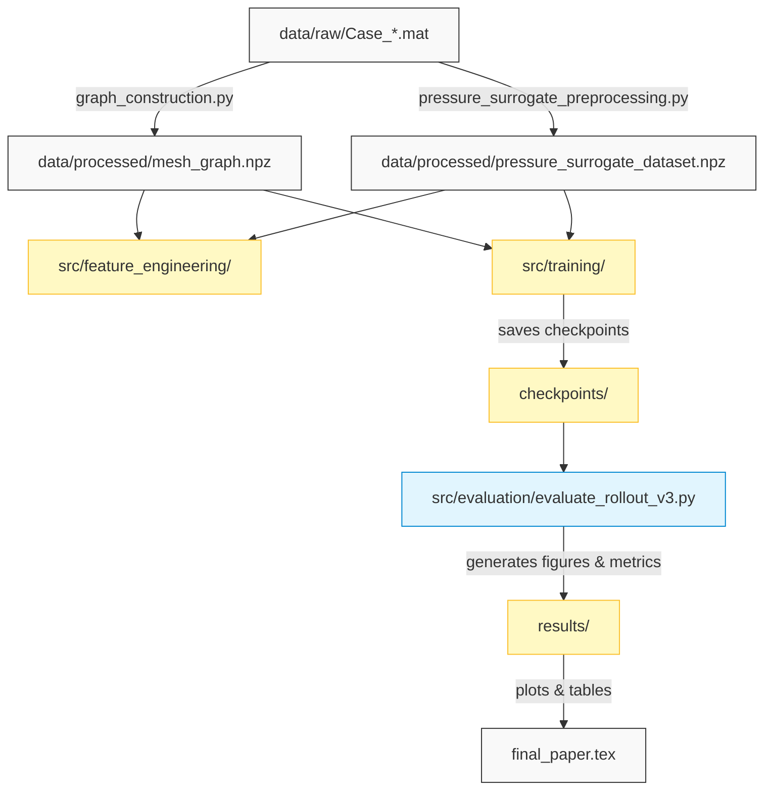

# Spatio-Temporal Graph Neural Networks for Underground Hydrogen Storage Forecasting on Irregular PEBI Meshes

[](https://www.python.org/)
[](https://pytorch.org/)
[](LICENSE)
[](docs/reproducibility.md)

Underground Hydrogen Storage (UHS) in depleted reservoirs is a cornerstone for grid-scale green energy capacity. Emulating transient fluid flow dynamics is computationally expensive using classical Finite Volume Method (FVM) simulators. This repository contains the code, trained models, figures, tables, and manuscript files for our paper introducing a native Graph Neural Network surrogate framework that operates directly on irregular PEBI (Perpendicular Bisection) Voronoi meshes.

---

## ⚡ Highlights & Key Findings

* **The Autocorrelation Trap Exposed**: We show why predicting absolute pressure ($P_{t+1}$) is a deceptive target ($R^2 > 0.99$ for zero-physics persistence models) and establish the pressure-change target ($\Delta P_t$) as mathematically rigorous.
* **Temporal Inertia Analysis**: A single-step temporal pressure lag ($\Delta P_{t-1}$) contains **$64.65\%$** of predictive Gini importance.
* **Darcy-Weighted Message Passing**: Formulates GNN convolutions scaled by physical inter-cell transmissibility ($T_{ij}$) on irregular PEBI meshes.
* **Stable 142-Step Rollouts**: Leverages Layer Normalization, residual connections, and scheduled sampling to reduce rollout pressure RMSE by **$23\%$** over the base ST-GNN.

---

## 🏗️ Repository Architecture



---

## 📊 Summary of Results

### 1. Baselines (Single-Step $\Delta P_t$ Prediction RMSE)
Evaluating the impact of feature engineering stacks on held-out Case 5:
* **Baseline Features** (Local properties only): RF RMSE = `4.54` | MLP RMSE = `3.20`
* **Spatial Features** (+ Neighborhood & Gradients): RF RMSE = `4.54` | MLP RMSE = `3.23`
* **Spatiotemporal Features** (+ $\Delta P_{t-1}$ History): **RF RMSE = `0.55`** | **MLP RMSE = `0.91`**

### 2. ST-GNN Rollout Performance (142-Step Autoregressive Prediction)
Comparison of GNN architectures on held-out Case 5:

| Model Version | Architecture Additions | Mean Pressure RMSE (psi) | Mean Gas Saturation RMSE | Max Pressure Error (psi) |
| :--- | :--- | :---: | :---: | :---: |
| **ST-GNN v1** | Baseline | `35.26` | `0.0167` | `278.29` |
| **ST-GNN v2** | + LayerNorm & Residuals | `31.72` | `0.0223` | `240.64` |
| **ST-GNN v3** | + Weighted Loss (Target $\times$ 10) | **`27.15`** | **`0.0181`** | **`187.68`** |

*Note: GNN v3 achieves a **$23.01\%$** pressure error reduction relative to v1.*

---

## 🚀 Quick Start (60-Second Setup)

### 1. Clone & Set Up Environment
No complex PyTorch Geometric compilation is needed. Customize using Conda or Pip:
```bash
# Clone the repo
git clone https://github.com/username/stgnn-uhs-pebi.git
cd stgnn-uhs-pebi

# Setup environment (Conda)
conda env create -f environment.yml
conda activate sciml_models
```

### 2. Download Raw Datasets
To run evaluations, the 5 raw simulator `.mat` files are required. Since they are excluded from Git for repository lightweightness, download them using instructions in [data/README.md](data/README.md) and place them in:
```
data/raw/Case_0001_wj.mat
...
data/raw/Case_0005_wj.mat
```

### 3. Run Automated Validation Pipeline
Execute the complete validation script (which runs graph construction, feature training, GNN evaluations, figure plotting, LaTeX assembly, and integrity checks):
* **Linux/macOS**: `./reproduce_results.sh`
* **Windows (PowerShell)**: `.\reproduce_results.ps1`

---

## 🛠️ Step-by-Step Commands

For fine-grained manual execution:

```bash
# 1. Build mesh graph structure and transmissibilities
python src/graph_construction/graph_construction.py

# 2. Structure datasets & fit standard scalers
python src/preprocessing/pressure_surrogate_preprocessing.py

# 3. Train and evaluate baseline ML models
python src/feature_engineering/phase4_spatial_temporal_features.py

# 4. Run multi-step GNN rollout evaluation
python src/evaluation/evaluate_rollout_v3.py

# 5. Generate manuscript plots and schematics
python src/utils/generate_missing_plots.py
python src/utils/generate_fig7_stgnn.py

# 6. Assemble manuscript and validate references
python src/utils/reconstruct_final_paper.py
python src/utils/validate_latex.py
```

---

## 📝 Citation

If you use this work or codebase in your research, please cite:
```bibtex
@misc{kumar2026spatiotemporal,
  author       = {Kumar, Ankit and Lal, Shankar and Pal, Mayur},
  title        = {Spatio-Temporal Graph Neural Networks for Underground Hydrogen Storage Forecasting on Irregular PEBI Meshes},
  year         = {2026},
  publisher    = {GitHub},
  journal      = {GitHub Repository},
  howpublished = {\url{https://github.com/username/stgnn-uhs-pebi}}
}
```
*For complete citation details, see [CITATION.cff](CITATION.cff).*
