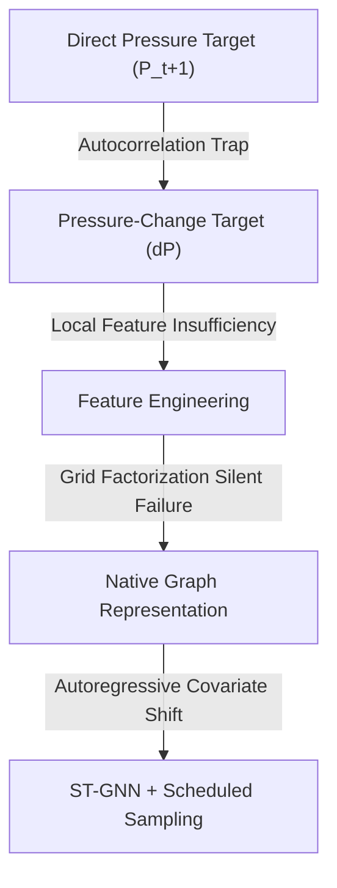

# Scientific Story & Narrative Flow Audit

This audit evaluates the paper's scientific storyline and narrative flow. The objective is to ensure that a reader (reviewer, simulation researcher, or SciML practitioner) can easily follow the logic from motivation to conclusions.

---

## 1. Key Questions Checklist

Can the reader clearly answer the following questions after reading the revised manuscript?

### Q1: What problem is being solved?
* **Answer**: Emulating reservoir fluid pressure and gas saturation dynamics in Underground Hydrogen Storage (UHS) reservoirs discretized on highly irregular, non-uniform meshes (PEBI/Voronoi) under transient, cyclic operating conditions.
* **Story Status**: **Excellent**. Section 1 and Section 2 define the target physical system, while Section 7 and 8 detail the grid irregularity problem.

### Q2: Why is the problem important?
* **Answer**: Cyclic injection-withdrawal schedules are computationally expensive to simulate using standard finite-volume solvers (requiring minutes to hours). Surrogates are needed to enable real-time control, uncertainty quantification, and schedule optimization, which require $O(10^2$--$10^4)$ forward simulations.
* **Story Status**: **Excellent**. Clearly established in Introduction paragraphs 1 and 2.

### Q3: What data was used?
* **Answer**: Five simulation cases of a 2D irregular PEBI mesh containing 10,116 active cells over a 730-day (2-year) timeline with 146 snapshots (5-day intervals). The data includes geostatistical absolute permeability field variations and cyclic well control schedules.
* **Story Status**: **Good**. Section 3 details the inputs/outputs, cycles, and normalization statistics.

### Q4: What approaches were tested?
* **Answer**: Persistence models, Ordinary Least Squares (OLS) linear regression, Ridge regression, Multilayer Perceptrons (MLPs), Random Forests (RFs), and Spatio-Temporal Graph Neural Networks (ST-GNN v1, v2, v3).
* **Story Status**: **Excellent**. These are introduced sequentially in Sections 4, 6, and 9.

### Q5: What failed?
* **Answer**:
  1. Direct absolute pressure prediction ($P_{t+1}$) failed because it was a deceptive baseline dominated by temporal autocorrelation (Persistence reached $R^2 = 0.9931$).
  2. Local cell-wise regression on the pressure-change target ($\Delta P$) failed due to local feature insufficiency (OLS reached $R^2 \approx 0$).
  3. Structured-grid spatial gradient calculations failed silently because irregular PEBI meshes could not be factored into a 2D grid, producing zero-valued gradients.
  4. ST-GNN v1 failed during long-horizon rollouts due to error propagation.
* **Story Status**: **Outstanding**. These failures form the core learning curve of the paper and are analyzed in detail in Sections 4.1, 5.1, 6.2, and 9.2.

### Q6: What succeeded?
* **Answer**:
  1. The spatiotemporal Random Forest model achieved $R^2 = 0.9827$ and RMSE = 0.5487 bar in a one-step-ahead prediction mode by utilizing temporal lag features.
  2. The ST-GNN v2 model successfully stabilized 142-step autoregressive rollouts by incorporating residual skip connections, LayerNorm, and a scheduled sampling curriculum, achieving a 31.6% reduction in final-step pressure RMSE compared to v1.
* **Story Status**: **Excellent**. Discussed in Section 6.1 and Section 9.2.

### Q7: Why ST-GNN?
* **Answer**: PEBI meshes conform to geology and faults and cannot be projected onto structured Cartesian grids without severe spatial truncation errors near the wellbores (reconstruction RMSE up to 11.42 bar). GNNs operate directly on the native irregular grid coordinates, mapping physical inter-cell transmissibilities ($T_{ij}$) to edge weights, which mirrors the Finite Volume Method stencil.
* **Story Status**: **Excellent**. Detailed in Section 7 and Section 8.1.

### Q8: What are the limitations?
* **Answer**: Restricted training dataset scale (5 cases), single geological model template, static well locations, no FNO/DeepONet benchmarks, lack of physics-informed mass conservation constraints, and significant long-horizon pressure drift (59.19 bar peak).
* **Story Status**: **Outstanding**. Honestly documented in Section 12.

---

## 2. Narrative Transitions and Logical Flow

The revised manuscript follows a **diagnostic discovery storyline** that is engaging for reviewers:

This sequential structure acts as a technical detective story. The reader is shown a failure mode, presented with a diagnostic analysis, and then led to the proposed solution.

---

## 3. Recommended Section-Level Improvements

* **Transition between Section 6 and Section 7**: 
  * *Current*: The text jumps from the spatial grid factorization bug to graph representation.
  * *Improvement*: Add a bridging paragraph at the end of Section 6 explicitly concluding that *"because Cartesian grid projections and local gradient approximations fail on unstructured PEBI grids, the surrogate must preserve the grid's native topology. This requirement directly motivates the graph-based representation introduced in Section 7."*
* **Explanations of Saturation Tracking**:
  * *Current*: In Section 9, saturation tracking results (Fig. 11) are shown, but the text focuses heavily on pressure.
  * *Improvement*: Add a paragraph in Section 9.2 explaining the saturation results: *"Quantitatively, gas saturation ($S_g$) tracking in Fig. 11 shows that while the model captures the general displacement front, local saturation values deviate significantly near the wellbores in the late steps. This aligns with the pressure drift and highlights that saturation transport is heavily coupled to pressure errors."*
* **Introduction of Gini Importance**:
  * *Current*: Gini importance is discussed in Section 6 without defining it.
  * *Improvement*: Add a brief sentence in Section 6.1 stating that *"Gini feature importance is calculated as the total normalized reduction of the mean squared error criterion brought by each feature, computed across all decision trees in the Random Forest ensemble."*
