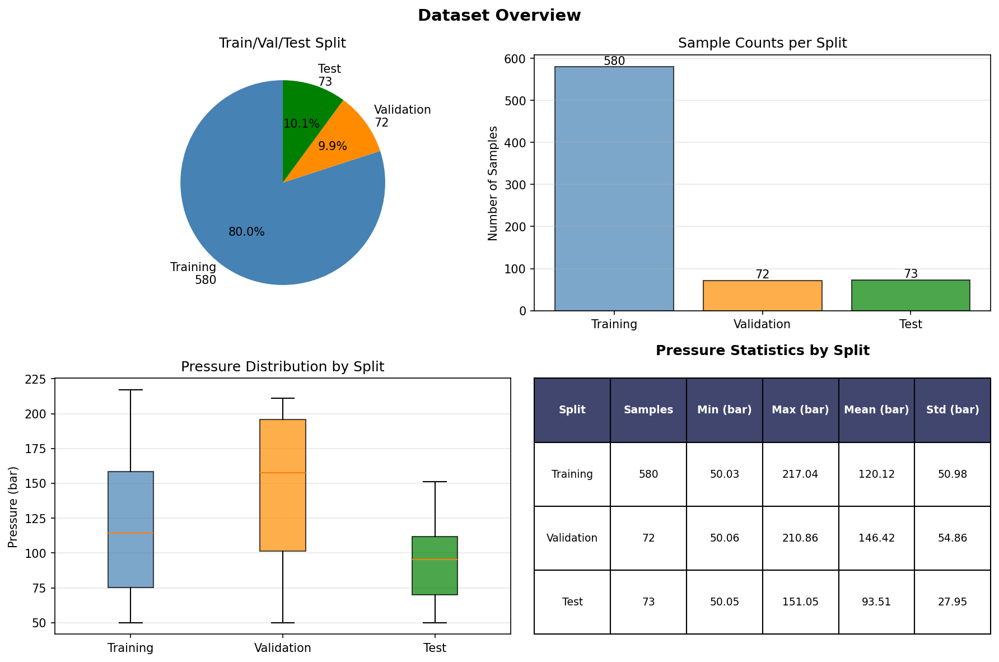
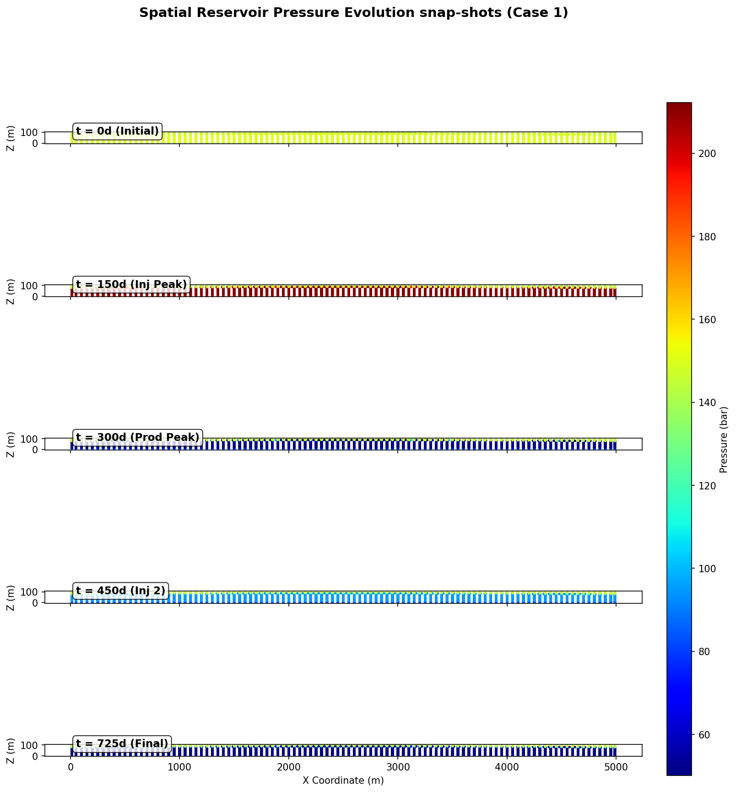
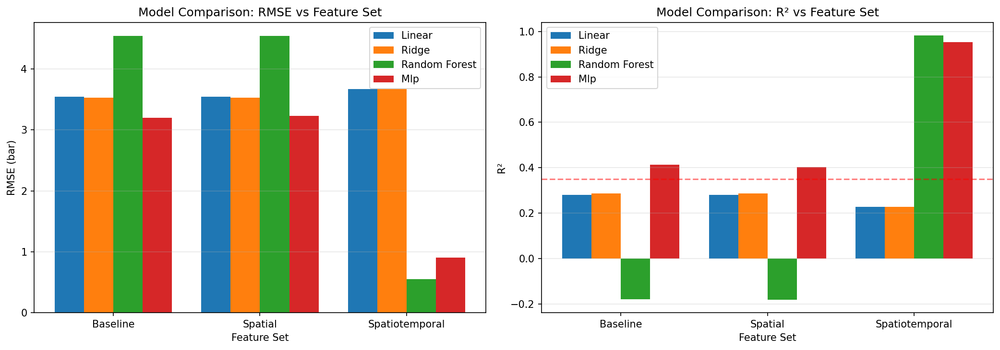
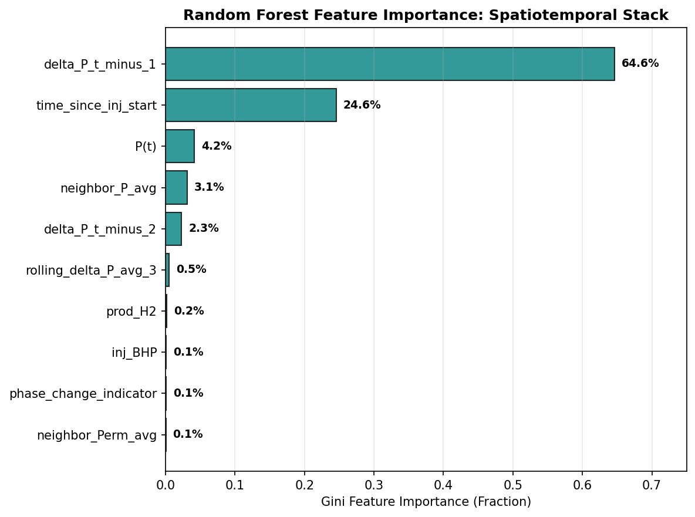
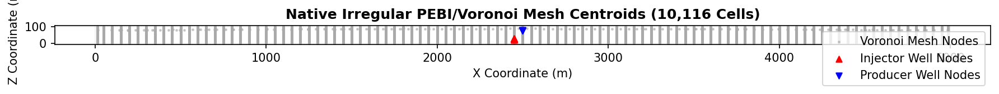
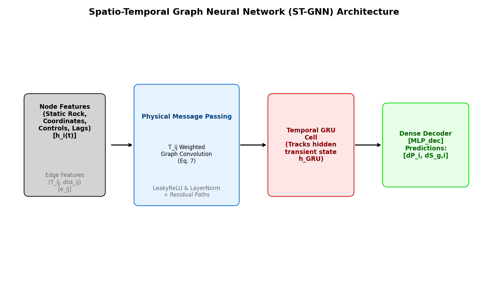
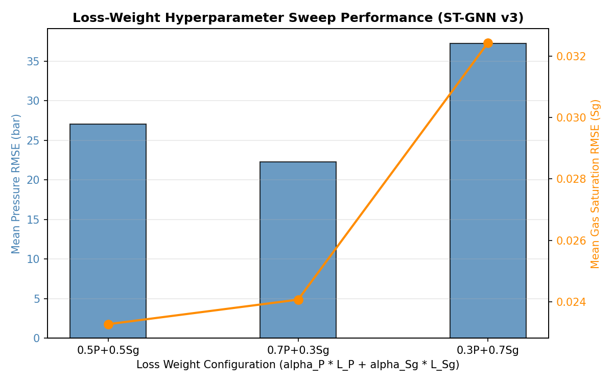
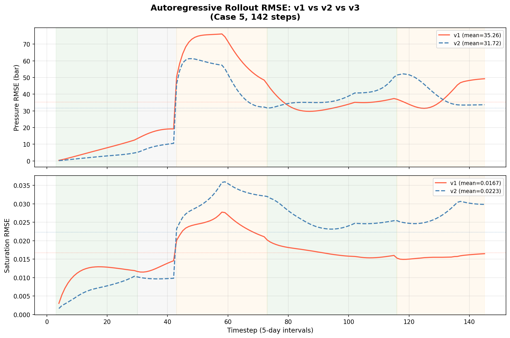
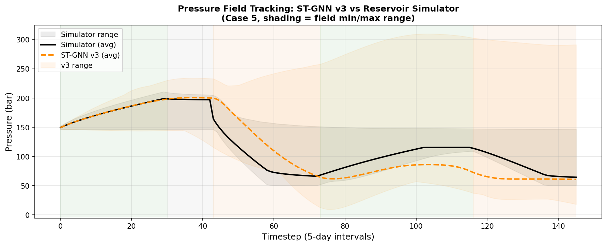
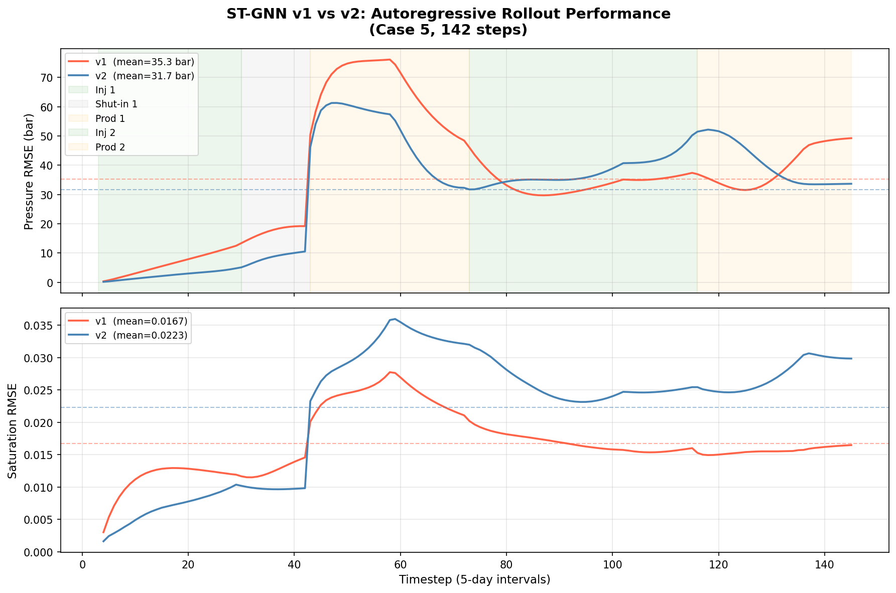

# Introduction

Hydrogen is increasingly recognized as a long-duration energy carrier
capable of decoupling renewable electricity generation from seasonal
demand fluctuations [@verma2024uhs]. Underground Hydrogen Storage (UHS)
in depleted gas reservoirs and deep saline aquifers provides the
volumetric capacity required for this role, but the operational reality
differs substantially from conventional natural gas
storage [@pal2024uhsLithuania]. Hydrogen's low viscosity and density
promote fingering instabilities and gravity-driven segregation; its
reactivity with reservoir brines and resident microbes introduces
geochemical and biological sinks; and the need for frequent
injection-withdrawal cycles to follow renewable intermittency imposes
highly transient pressure and saturation fields throughout the
formation [@rashid2023geoenergy].

High-fidelity reservoir simulators --- ECLIPSE, INTERSECT, tNavigator,
and similar finite-volume codes --- solve the coupled, non-linear PDEs
governing these multi-phase flows with sufficient accuracy for
field-scale planning studies. However, a single simulation of a 2-year
storage cycle over tens of thousands of grid cells can require minutes
to hours of wall-clock time. This computational cost becomes prohibitive
for applications that demand many repeated evaluations: Bayesian history
matching, uncertainty quantification, sensitivity analysis, and
closed-loop schedule optimization all require ensembles of
$\mathcal{O}(10^2$--$10^4)$ simulations. Building fast surrogate
emulators is therefore an active research
priority [@pal2023ccs; @pal2021mlhistory].

Scientific Machine Learning (SciML) offers a range of architectures for
this task [@schmidt2020]. Convolutional neural networks (CNNs) and
ConvLSTMs have been applied to structured Cartesian reservoir grids with
promising accuracy, and operator-learning frameworks such as the Fourier
Neural Operator (FNO) extend this to function-space
approximations [@farchi2021]. Nonetheless, geological reservoir models
are rarely discretized on uniform Cartesian grids. Perpendicular
Bisection (PEBI) and Voronoi tessellations are the industry standard
because they conform naturally to geological faults, pinch-outs, and
horizontal well trajectories, provide locally refined cells near
wellbores without global refinement, and satisfy the orthogonality
conditions required by two-point flux approximation (TPFA)
schemes [@ahmed2015mpfa]. Grid-based neural architectures require a
regular input domain, so applying them to PEBI meshes necessitates
interpolation onto a structured grid --- an operation that introduces
significant truncation errors, particularly near wellbores where
pressure gradients are steepest.

Graph Neural Networks (GNNs) provide a natural remedy [@geometric]. By
representing the reservoir as a graph $G = (V, E)$ in which cells are
nodes and shared cell faces are edges, GNNs can operate directly on the
native mesh topology. Edge attributes derived from physical
transmissibilities encode the conductivity of fluid pathways in a form
directly analogous to the finite-volume stencil [@pal2006tensor], making
the resulting message-passing operations a learned generalization of the
classical FVM update.

The present work addresses four interrelated problems in building
GNN-based UHS surrogates on irregular PEBI meshes. We make the following
concrete contributions:

1.  **Identification of an evaluation pitfall.** We demonstrate that
    direct next-step pressure prediction is a deceptive surrogate target
    because temporal autocorrelation allows trivial models to achieve
    $R^2 > 0.99$, and we quantify the gap between this metric and
    genuine physical accuracy.

2.  **Pressure-change formulation.** We reformulate the surrogate target
    as the one-step pressure increment
    $\Delta P_i(t) = P_i(t+1) - P_i(t)$, aligning the regression
    objective with the physical derivative terms in the discretized flow
    equations.

3.  **Temporal inertia analysis.** Through systematic feature
    engineering and importance analysis we show that local temporal lag
    features dominate predictive performance and provide a physical
    explanation in terms of transient pressure diffusion.

4.  **Native graph representation.** We identify and explain the failure
    of structured-grid spatial features on PEBI meshes and construct a
    GNN graph in which physical transmissibilities serve as edge
    weights, avoiding grid interpolation entirely.

5.  **ST-GNN rollout study.** We train and evaluate three versions of a
    Spatio-Temporal GNN in full autoregressive rollout mode,
    demonstrating the benefit of residual connections, Layer
    Normalization, and scheduled sampling for long-horizon stability.

We do not claim that the models presented here are ready for field
deployment or that they generalize beyond the specific reservoir
geometry and operational envelope of the training data; these
limitations are discussed explicitly in
Section [11](#sec:limitations){reference-type="ref"
reference="sec:limitations"}.

# Background and Governing Physics {#sec:physics}

Multi-phase fluid flow in porous media is governed by Darcy's law
combined with mass conservation for each fluid phase. For a two-phase
water-gas (H$_2$) system, the conservation equation for phase
$\beta \in \{w, g\}$ is

$$\begin{equation}
\label{eq:mass_cons}
\nabla \cdot \left[ \frac{\mathbf{k}\, k_{r\beta}}{\mu_\beta B_\beta}
  \left(\nabla P_\beta - \rho_\beta g \nabla Z\right) \right] + q_\beta
= \frac{\partial}{\partial t} \left( \frac{\phi S_\beta}{B_\beta} \right),
\end{equation}$$

where $\mathbf{k}$ is the absolute permeability tensor, $k_{r\beta}$ is
the relative permeability of phase $\beta$, $\mu_\beta$ is viscosity,
$B_\beta$ is the formation volume factor, $P_\beta$ is phase pressure,
$\rho_\beta$ is fluid density, $g$ is gravitational acceleration, $Z$ is
elevation, $\phi$ is porosity, $S_\beta$ is phase saturation, and
$q_\beta$ is the volumetric well source/sink term. Phase saturations
satisfy the closure relation $S_w + S_g = 1$.

For a single-phase compressible system this reduces to the transient
pressure diffusion equation

$$\begin{equation}
\label{eq:diffusion}
\phi c_t \frac{\partial P}{\partial t}
= \nabla \cdot \left( \frac{\mathbf{k}}{\mu} \nabla P \right) + q,
\end{equation}$$

where $c_t$ is the total rock-fluid compressibility.
Equation [\[eq:diffusion\]](#eq:diffusion){reference-type="eqref"
reference="eq:diffusion"} serves as the conceptual foundation for the
surrogate targets discussed in
Sections [4](#sec:baseline){reference-type="ref"
reference="sec:baseline"} and [5](#sec:delta_p){reference-type="ref"
reference="sec:delta_p"}.

## Finite Volume Discretization on PEBI Meshes

Reservoir simulators integrate
Eq. [\[eq:diffusion\]](#eq:diffusion){reference-type="eqref"
reference="eq:diffusion"} over each control volume $i$ of pore volume
$V_i$ to obtain the semi-discrete update

$$\begin{equation}
\label{eq:fvm}
V_i \phi_i c_{t,i} \frac{d P_i}{d t}
= \sum_{j \in N(i)} T_{ij}\left(P_j - P_i\right) + Q_i,
\end{equation}$$

where $N(i)$ denotes the face-adjacent neighbors of cell $i$ and $Q_i$
is the well contribution. The inter-cell transmissibility $T_{ij}$ is
computed via the two-point harmonic
average [@ahmed2015mpfa; @pal2006tensor]:

$$\begin{equation}
\label{eq:trans}
T_{ij} = A_{ij}\, \frac{2 k_i k_j}{\mu\left(k_i d_j + k_j d_i\right)},
\end{equation}$$

where $A_{ij}$ is the shared face area and $d_i, d_j$ are the
centroid-to-face distances.
Equation [\[eq:fvm\]](#eq:fvm){reference-type="eqref"
reference="eq:fvm"} makes explicit that the pressure change at cell $i$
is a function of (i) local rock properties, (ii) the pressure difference
with each neighbor weighted by transmissibility, and (iii) the temporal
derivative of the local state. This structure directly motivates both
the $\Delta P$ target formulation and the transmissibility-weighted GNN
message passing introduced in
Section [8](#sec:stgnn){reference-type="ref" reference="sec:stgnn"}.

# Dataset and Reservoir Description {#sec:dataset}

## Simulation Cases and Mesh

The dataset comprises five complete reservoir simulation cases, each
representing a two-year cyclic H$_2$ storage operation in the same
geological model. The reservoir is discretized on a 2D irregular
PEBI/Voronoi mesh containing 10,116 active control cells. Cell centroid
coordinates span $X_i \in [12.5,\,4987.5]$ m in the lateral direction
and $Z_i \in [0.25,\,99.75]$ m in depth. Each simulation produces 146
output snapshots at a uniform 5-day reporting interval (730 days total).
Across the five cases, permeability field realizations and well
operating schedules are varied; full details of the geostatistical
parameterization and schedule ranges are available in the companion
dataset documentation.

A representative overview of reservoir geometry, pressure evolution, and
mesh topology is shown in
Figures [1](#fig:dataset_overview){reference-type="ref"
reference="fig:dataset_overview"}
and [2](#fig:pressure_snapshots){reference-type="ref"
reference="fig:pressure_snapshots"}; the cell connectivity graph is
illustrated in Figure [5](#fig:mesh_topology){reference-type="ref"
reference="fig:mesh_topology"}.

<figure id="fig:dataset_overview" data-latex-placement="htbp">

<figcaption>Overview of the five UHS simulation cases. Each panel shows
the spatial distribution of absolute permeability (<em>k</em>, mD) on the 10,116-cell PEBI mesh.
Variability across realizations spans approximately one order of
magnitude.</figcaption>
</figure>

<figure id="fig:pressure_snapshots" data-latex-placement="htbp">

<figcaption>Pressure field snapshots at representative timesteps during
the injection, shut-in, and production phases of Case 1 (bar). Transient
gradients are largest near the injector and producer wells.</figcaption>
</figure>

## Variables and Operational Cycles

Each simulation tracks 46 physical quantities. For model development the
relevant outputs are grouped into three categories:

- **Spatio-temporal state matrices** ($10{,}116 \times 146$): cell
  pressure $P_i(t)$, gas and water saturation $S_{g,i}(t)$,
  $S_{w,i}(t)$, and H$_2$ mole fractions in vapor and liquid phases
  $y_{\mathrm{H}_2,i}(t)$, $x_{\mathrm{H}_2,i}(t)$.

- **Dynamic well controls** ($1 \times 146$ per well): bottomhole
  pressure (BHP) targets and volumetric flow rates for the injector and
  producer.

- **Static geometry and rock properties** ($10{,}116 \times 1$): cell
  centroid coordinates $(X_i, Z_i)$, absolute permeability $k_i$, and
  porosity $\phi_i$.

The nominal operational cycle within each two-year run consists of
active H$_2$ injection (steps 1--60), a shut-in period (steps 61--86),
and active production (steps 87--146). Well control transitions for the
injector occur at step indices 30, 73, and 103; for the producer at
indices 43, 73, and 116. These transition boundaries are important for
modeling because they produce step changes in the driving force for
pressure evolution.

## Train/Test Split and Normalization

Cases 1--4 form the training set (584 timesteps $\times$ 10,116 cells),
while Case 5 is held out as an independent test case. This split was
chosen to evaluate whether the surrogate can reproduce a complete cyclic
storage trajectory not seen during training, given that only five cases
are available. We emphasize that this is an interpolation within a
narrow operational envelope rather than a test of extrapolation to
different geology or well configurations.

All dynamic variables are normalized using Z-score standardization.
Normalization statistics ($\mu_{\mathrm{train}}$,
$\sigma_{\mathrm{train}}$) are computed exclusively from Cases 1--4 to
prevent test-set leakage. The time-step size is constant at 5 days
throughout all cases and therefore carries no information; it is
excluded from all feature sets and normalization tables. Normalization
parameters for the retained input features are listed in
Table [1](#tab:dataset_stats){reference-type="ref"
reference="tab:dataset_stats"}.

::: {#tab:dataset_stats}
  **Feature**   **Physical quantity**              $\mu_{\mathrm{train}}$   $\sigma_{\mathrm{train}}$
  ------------- --------------------------------- ------------------------ ---------------------------
  `Perm`        Abs. permeability (mD)                    203.316                    209.847
  `Poro`        Porosity (fraction)                        0.1076                    0.0249
  `P(t)`        Pressure at step $t$ (bar)                120.703                    50.763
  `inj_BHP`     Injector BHP (bar)                        122.642                    74.137
  `prod_BHP`    Producer BHP (bar)                         69.938                    49.010
  `inj_H2`      H$_2$ injection rate (vol/day)             3.527                      4.198
  `prod_H2`     H$_2$ production rate (vol/day)            2.243                      3.581
  `t_index`     Timestep index (---)                       72.000                    41.857

  : Z-score normalization statistics for input features computed from
  training Cases 1--4. The constant time-step variable (`dt_days`) is
  excluded as it contributes zero variance.
:::

# Baseline Surrogate Models and the Autocorrelation Trap {#sec:baseline}

A natural starting point for surrogate construction is to train a
regressor that maps local cell inputs at time $t$ to the absolute cell
pressure at $t+1$:

$$\begin{equation}
\hat{P}_i(t+1) = f\!\left(X_{\mathrm{local},i}(t)\right),
\end{equation}$$

where $X_{\mathrm{local},i}(t)$ collects static rock properties, the
current pressure, and well control signals. We trained three models on
Cases 1--4 under this formulation and evaluated them on Case 5:

1.  **Persistence baseline**: $\hat{P}(t+1) = P(t)$ --- no parameters.

2.  **Ordinary least squares (OLS)**: Linear regression on the 8-feature
    baseline input vector.

3.  **MLP (128-64)**: Two-hidden-layer fully connected network with ReLU
    activations, trained with the Adam optimizer at a learning rate of
    $10^{-3}$.

The resulting metrics on Case 5 are summarized in
Table [2](#tab:baseline_results){reference-type="ref"
reference="tab:baseline_results"}. All three models achieve
$R^2 \geq 0.993$, which at first glance appears excellent. The
Persistence model itself reaches $R^2 = 0.9931$ with an RMSE of only
4.22 bar despite possessing no trainable parameters and no knowledge of
reservoir physics.

## The Autocorrelation Trap {#sec:autocorrelation}

The apparent strength of these metrics is an artifact of temporal
autocorrelation. Over a 5-day reporting interval, reservoir pressures
evolve smoothly; the correlation between $P_i(t)$ and $P_i(t+1)$ is
extremely high. Any regressor that learns to output a value close to its
input will therefore achieve near-unity $R^2$ on the absolute pressure
target, regardless of whether it captures any physical flow dynamics.
The learned increment above the persistence baseline provides a more
informative assessment of model skill, yet even the MLP improves on the
Persistence model by only $0.035$ in RMSE (3.42 bar vs. 4.22 bar) --- a
marginal gain that carries no guarantee of physical fidelity.

This finding parallels well-known issues in meteorological forecast
verification, where persistence baselines and skill scores relative to
climatology are standard practice [@farchi2021]. In the reservoir
surrogate literature, direct pressure $R^2$ is routinely reported
without reference to a persistence baseline, potentially inflating
perceived model quality [@pal2021mlhistory]. We therefore recommend that
future surrogate evaluations always report metrics on the
pressure-change target (Section [5](#sec:delta_p){reference-type="ref"
reference="sec:delta_p"}) alongside absolute pressure metrics.

::: {#tab:baseline_results}
+------------+------------------+----------+----------+---------------+----------------------------+
| **Target** | **Model**        | **RMSE   | **MAE    | **Rel. Err.** | $R^2$                      |
|            |                  | (bar)**  | (bar)**  |               |                            |
+:===========+:=================+:========:+:========:+:=============:+:==========================:+
| $P_{t+1}$  | Persistence      | 4.2180   | 2.0068   | 0.0198        | 0.9931                     |
|            +------------------+----------+----------+---------------+----------------------------+
|            | OLS              | 3.5266   | 1.3307   | 0.0114        | 0.9952                     |
|            +------------------+----------+----------+---------------+----------------------------+
|            | MLP (128-64)     | 3.4227   | 1.2009   | 0.0119        | 0.9955                     |
+------------+------------------+----------+----------+---------------+----------------------------+
| $\Delta P$ | Persistence      | 4.2180   | 3.5177   | 0.2043        | $-$`<!-- -->`{=html}0.0198 |
|            | ($\Delta P{=}0$) |          |          |               |                            |
|            +------------------+----------+----------+---------------+----------------------------+
|            | OLS              | 4.1756   | 3.4870   | 0.2030        | 0.0007                     |
|            +------------------+----------+----------+---------------+----------------------------+
|            | MLP (128-64)     | 3.3614   | 2.5611   | 0.1535        | 0.3524                     |
+------------+------------------+----------+----------+---------------+----------------------------+

: Baseline model performance on Test Case 5 for both the direct pressure
target ($P_{t+1}$) and the pressure-change target ($\Delta P$). The
Persistence model is included to expose the autocorrelation floor.
:::

# Pressure-Change Formulation {#sec:delta_p}

To align the surrogate target with the physical derivative terms in
Eq. [\[eq:fvm\]](#eq:fvm){reference-type="eqref" reference="eq:fvm"}, we
reformulate the regression problem as prediction of the one-step
pressure increment:

$$\begin{equation}
\label{eq:delta_p_def}
\Delta P_i(t) \;=\; P_i(t+1) - P_i(t) \;=\; f\!\left(X_{\mathrm{local},i}(t)\right).
\end{equation}$$

Under this target, the Persistence baseline (which predicts
$\Delta P = 0$) scores $R^2 = -0.0198$, immediately revealing that
models which appeared effective on the absolute pressure target were
doing little more than copying the input. The OLS model achieves
$R^2 = 0.0007$ --- statistically indistinguishable from the Persistence
baseline --- and the MLP reaches only $R^2 = 0.3524$. These numbers
reflect the genuine difficulty of the task.

## Feature Ablation and Local Feature Insufficiency

To understand why OLS fails so completely, we conducted a leave-one-out
feature ablation study on the $\Delta P$ target, measuring the change in
test RMSE when each input feature is removed in turn. The resulting
$\Delta\mathrm{RMSE}$ values were all within $\pm 0.0007$ bar for every
feature, including absolute permeability, current pressure, and all four
well control signals. This uniformity indicates that none of the
available local, cell-wise features carry meaningful predictive
information for $\Delta P$.

The physical explanation is straightforward. From
Eq. [\[eq:fvm\]](#eq:fvm){reference-type="eqref" reference="eq:fvm"},
the pressure change at cell $i$ is driven by the
transmissibility-weighted pressure differences with neighboring cells
and by the local well source term. Both of these quantities --- neighbor
pressures and localized well impact --- are absent from the baseline
feature set. A purely local model has no access to the spatial pressure
gradient information needed to reproduce Darcy flow, and without
temporal history it cannot characterize the transient decay following a
well control change.

# Feature Engineering and Scientific Insights {#sec:features}

To systematically recover the missing spatial and temporal information,
we constructed three progressively richer feature sets and evaluated
four model families: OLS, Ridge regression, Random Forest (RF), and MLP
(128-64). All models were trained on Cases 1--4 and evaluated on Case 5
targeting $\Delta P$.

1.  **Baseline** (8 features): Cell-local static properties ($k_i$,
    $\phi_i$), current pressure $P_i(t)$, and the four well control
    signals (BHP and rate for injector and producer).

2.  **Spatial** (18 features): Baseline extended with cell centroid
    coordinates $(X_i, Z_i)$, Euclidean distances to injector and
    producer wells, approximate local permeability gradients, and
    pressure averages over topological neighbor sets.

3.  **Spatiotemporal** (24 features): Spatial set augmented with two
    temporal pressure-change lags ($\Delta P_i(t-1)$,
    $\Delta P_i(t-2)$), time elapsed since the most recent
    injection-start and production-start events, and binary
    phase-transition flags.

Results are reported in
Table [3](#tab:feature_results){reference-type="ref"
reference="tab:feature_results"}.

## Temporal Inertia Dominates Spatial Information

Adding the temporal lag features produces a dramatic shift in
performance. The RF model trained on the Spatiotemporal set achieves
$R^2 = 0.9827$ and RMSE $= 0.549$ bar, compared to $R^2 = -0.181$ on the
Baseline set. Gini importance analysis
(Figure [4](#fig:feature_importance){reference-type="ref"
reference="fig:feature_importance"}) attributes 64.65% of total
importance to $\Delta P_{t-1}$ alone, and a further 24.58% to the time
elapsed since the last injection start, leaving all remaining features
below 5% combined.

The physical basis for this result is the transient pressure diffusion
analogy. Following a step change in well BHP, the pressure disturbance
at a given cell decays approximately exponentially with a characteristic
time constant proportional to $\phi c_t / k$. The previous pressure
change $\Delta P_{t-1}$ therefore encodes the instantaneous decay rate,
providing the local model with a proxy for the spatial gradient
information it cannot otherwise access. The elapsed-time feature
captures the position of the current step within the cyclic well
schedule, disambiguating between injection, shut-in, and production
regimes.

## Structured-Grid Spatial Features Silently Fail {#sec:grid_bug}

The Spatial feature set achieves essentially identical performance to
the Baseline for all four model families
(Table [3](#tab:feature_results){reference-type="ref"
reference="tab:feature_results"}), and Gini importance assigns exactly
0.0% to all spatial gradient features. Investigation of the
preprocessing pipeline revealed the cause: the code attempted to reshape
the 10,116-cell PEBI mesh into a 2D structured array by integer
factorization of the cell count. Because 10,116 has no factorization
close to a square or a typical aspect ratio, the code fell back to
treating the cells as a 1D vector. All finite-difference gradient
computations ($\nabla P_X$, $\nabla P_Z$) consequently returned zero for
every cell at every timestep.

This silent failure carries a broader lesson for SciML on irregular
meshes: structured-grid assumptions embedded in preprocessing code can
silently corrupt spatial features without raising any runtime errors,
and the resulting feature importance scores may incorrectly suggest that
spatial information is physically unimportant. Correct spatial coupling
on PEBI meshes requires either explicit graph-based neighbor indexing or
interpolation to a validated regular grid --- the former approach is
taken in Section [7](#sec:graph){reference-type="ref"
reference="sec:graph"}.

::: {#tab:feature_results}
+----------------+-------------+-------------+-------------+----------------------------+
| **Feature      | **Model**   | **RMSE      | **MAE       | $R^2$                      |
| Set**          |             | (bar)**     | (bar)**     |                            |
+:===============+:============+:===========:+:===========:+:==========================:+
| Baseline (8)   | OLS         | 3.5440      | 1.3581      | 0.2801                     |
|                +-------------+-------------+-------------+----------------------------+
|                | Ridge       | 3.5273      | 1.3275      | 0.2869                     |
|                +-------------+-------------+-------------+----------------------------+
|                | Random      | 4.5388      | 0.8151      | $-$`<!-- -->`{=html}0.1808 |
|                | Forest      |             |             |                            |
|                +-------------+-------------+-------------+----------------------------+
|                | MLP         | 3.1970      | 0.8589      | 0.4142                     |
|                | (128-64)    |             |             |                            |
+----------------+-------------+-------------+-------------+----------------------------+
| Spatial (18)   | OLS         | 3.5440      | 1.3581      | 0.2801                     |
|                +-------------+-------------+-------------+----------------------------+
|                | Ridge       | 3.5273      | 1.3275      | 0.2869                     |
|                +-------------+-------------+-------------+----------------------------+
|                | Random      | 4.5391      | 0.8166      | $-$`<!-- -->`{=html}0.1809 |
|                | Forest      |             |             |                            |
|                +-------------+-------------+-------------+----------------------------+
|                | MLP         | 3.2307      | 0.9170      | 0.4018                     |
|                | (128-64)    |             |             |                            |
+----------------+-------------+-------------+-------------+----------------------------+
| Spatiotemporal | OLS         | 3.6718      | 0.9898      | 0.2272                     |
| (24)           |             |             |             |                            |
|                +-------------+-------------+-------------+----------------------------+
|                | Ridge       | 3.6713      | 0.9866      | 0.2275                     |
|                +-------------+-------------+-------------+----------------------------+
|                | **Random    | **0.5487**  | **0.0941**  | **0.9827**                 |
|                | Forest**    |             |             |                            |
|                +-------------+-------------+-------------+----------------------------+
|                | **MLP       | **0.9063**  | **0.3557**  | **0.9529**                 |
|                | (128-64)**  |             |             |                            |
+----------------+-------------+-------------+-------------+----------------------------+

: Model performance on Test Case 5 (target: $\Delta P$) across three
feature sets. Note that the Spatial set performs identically to Baseline
due to the grid factorization failure described in
Section [6.2](#sec:grid_bug){reference-type="ref"
reference="sec:grid_bug"}.
:::

<figure id="fig:performance_comparison" data-latex-placement="htbp">

<figcaption>Comparison of <em>R</em>2 (top) and RMSE
(bottom) on Test Case 5 across the three feature sets and four model
families. The jump from the Spatial to the Spatiotemporal set is driven
entirely by the temporal lag features.</figcaption>
</figure>

<figure id="fig:feature_importance" data-latex-placement="htbp">

<figcaption>Gini feature importance rankings from the Random Forest
model trained on the Spatiotemporal feature set. The lag term <em>Δ</em><em>P</em><em>t</em> − 1
accounts for 64.65% of total importance; all spatial geometry features
collectively contribute less than 2%.</figcaption>
</figure>

# Graph-Based Surrogate Modeling {#sec:graph}

The analysis in Section [6.2](#sec:grid_bug){reference-type="ref"
reference="sec:grid_bug"} establishes that correct spatial coupling on a
PEBI mesh requires operating on the native mesh adjacency graph rather
than an interpolated structured grid. We therefore represent the
reservoir as a directed graph

$$\begin{equation}
G = (V,\, E),
\end{equation}$$

where each control cell $i$ is a node $v_i \in V$ and each shared cell
face defines a directed edge $e_{ij} \in E$. This one-to-one
correspondence between the graph and the FVM stencil means that the GNN
message-passing neighborhood mirrors the physical neighborhood of
Eq. [\[eq:fvm\]](#eq:fvm){reference-type="eqref" reference="eq:fvm"},
with no approximation from grid projection.

## Node and Edge Feature Construction

Node features $\mathbf{h}_i \in \mathbb{R}^{20}$ are assembled from:
static rock attributes ($k_i$, $\phi_i$), cell centroid coordinates
($X_i$, $Z_i$), Euclidean distances to the injector and producer wells,
dynamic state variables at the current timestep ($P_i(t)$, $S_{g,i}(t)$,
$S_{w,i}(t)$, $y_{\mathrm{H}_2,i}(t)$, $x_{\mathrm{H}_2,i}(t)$), three
timesteps of pressure-change history ($\Delta P_i(t-1)$,
$\Delta P_i(t-2)$, $\Delta P_i(t-3)$), time elapsed since well cycle
start events, and localized well BHP, flow rate, and active-status
signals.

Edge features $\mathbf{e}_{ij} \in \mathbb{R}^{3}$ encode the physical
geometry and conductivity of the shared cell face: inter-centroid
distance $d_{ij}$, face area $A_{ij}$, and the two-point
transmissibility $T_{ij}$ from
Eq. [\[eq:trans\]](#eq:trans){reference-type="eqref"
reference="eq:trans"}. Including $T_{ij}$ as an edge attribute allows
the GNN to learn transmissibility-weighted aggregation rules that are
physically interpretable in terms of Darcy flux.

<figure id="fig:mesh_topology" data-latex-placement="htbp">

<figcaption>Mapping of the irregular PEBI/Voronoi mesh to a directed
graph. Cell centroids define nodes (blue circles); shared cell faces
define directed edges (arrows). Edge thickness is proportional to
inter-cell transmissibility <em>T</em><em>i</em><em>j</em>.</figcaption>
</figure>

# Spatio-Temporal GNN Architecture {#sec:stgnn}

## Message Passing with Transmissibility Weighting

The spatial aggregation step at GNN layer $l$ is defined as

$$\begin{equation}
\label{eq:mp}
m_i^{(l)} = \sum_{j \in N(i)} \tilde{T}_{ij}\,
  \mathrm{MLP}_{\mathrm{neigh}}\!\left(h_j^{(l-1)}\right)
  + \mathrm{MLP}_{\mathrm{self}}\!\left(h_i^{(l-1)}\right),
\end{equation}$$

where $\tilde{T}_{ij} = T_{ij} / \sum_{k \in N(i)} T_{ik}$ is the
row-normalized transmissibility weight and the MLP blocks are single
linear layers. This formulation is analogous to the FVM flux sum in
Eq. [\[eq:fvm\]](#eq:fvm){reference-type="eqref" reference="eq:fvm"},
with the neural network learning residual corrections to the linear
transmissibility weighting. To stabilize training through four stacked
GCN layers, residual connections and Layer Normalization are applied
after each aggregation:

$$\begin{equation}
h_i^{(l)} = \mathrm{LayerNorm}\!\left(
  \mathrm{LeakyReLU}\!\left(m_i^{(l)}\right)
  + W_{\mathrm{res}}\, h_i^{(l-1)}
\right).
\end{equation}$$

## Temporal Gating via GRU

After spatial aggregation, a Gated Recurrent Unit (GRU) maintains a
persistent hidden state $\mathbf{s}_i(t) \in \mathbb{R}^{d_h}$ for each
node across timesteps, capturing transient memory that cannot be
recovered from the instantaneous node features alone. The final
predictions are decoded from the GRU output:

$$\begin{equation}
\left[\widehat{\Delta P}_i(t),\; \widehat{\Delta S}_{g,i}(t)\right]^{\mathsf{T}}
= \mathrm{MLP}_{\mathrm{dec}}\!\left(\mathbf{s}_i(t)\right).
\end{equation}$$

The full architecture is illustrated in
Figure [6](#fig:stgnn_arch){reference-type="ref"
reference="fig:stgnn_arch"}.

<figure id="fig:stgnn_arch" data-latex-placement="htbp">

<figcaption>Architecture of the Spatio-Temporal GNN. Node features from
the current timestep are processed by four transmissibility-weighted GCN
layers with residual connections and LayerNorm, passed through a GRU for
temporal memory, and decoded to <em>Δ</em><em>P</em> and <em>Δ</em><em>S</em><em>g</em>
predictions.</figcaption>
</figure>

## Scheduled Sampling for Rollout Stability

Models trained entirely under teacher forcing --- where ground-truth
states are fed at every timestep --- encounter a distribution mismatch
at inference time when they must consume their own predictions as
inputs. To mitigate this covariate shift, we adopt a scheduled sampling
strategy [@farchi2021]: the rollout probability $p_{\mathrm{rollout}}$
is linearly annealed from $0.0$ to $0.5$ over the training epochs, so
the model is progressively exposed to its own prediction errors during
training. Gas saturation predictions are clipped to $[0, 1]$ after each
step to maintain physical feasibility, and water saturation is updated
via $S_w = 1 - S_g$.

## Multi-Objective Loss Formulation

Because the surrogate jointly predicts pressure and saturation
increments, the training loss combines normalized MSE terms for both
targets:

$$\begin{equation}
\mathcal{L} = \alpha_P\,\mathcal{L}_P + \alpha_{S_g}\,\mathcal{L}_{S_g},
\end{equation}$$

where $\mathcal{L}_P$ and $\mathcal{L}_{S_g}$ are computed in the
normalized space to place the two targets on comparable scales. A
systematic sweep over three weight configurations
($\alpha_P$:$\alpha_{S_g}$ $= 0.5$:$0.5$, $0.7$:$0.3$, $0.3$:$0.7$) is
conducted to identify the configuration that best balances pressure and
saturation accuracy.

# Rollout Forecasting Results {#sec:results}

All models are evaluated by performing a complete 142-step
autoregressive rollout on Case 5, initializing with the ground-truth
state at timestep 4 (to allow three lags to be populated) and feeding
model predictions back as inputs for subsequent steps.

## Loss-Weight Sweep

Table [4](#tab:stgnn_comparison){reference-type="ref"
reference="tab:stgnn_comparison"} reports aggregate rollout metrics for
the three loss-weight configurations, each trained for 20 epochs (ST-GNN
v3 family). A composite balance score
$= (\bar{\mathrm{RMSE}}_P / \bar{P}_{\mathrm{ref}}) + (\bar{\mathrm{RMSE}}_{S_g} / 1.0)$
was used to compare configurations on a common dimensionless basis. The
balanced configuration ($0.5$:$0.5$) achieves the lowest score of
$0.00555$, corresponding to a mean pressure RMSE of 25.49 bar and mean
saturation RMSE of $0.0218$. Both the pressure-heavy ($0.7$:$0.3$, score
$= 0.01060$) and saturation-heavy ($0.3$:$0.7$, score $= 0.01095$)
configurations perform worse on this composite metric. All subsequent
comparisons use the balanced loss.

Loss-weight sweep results are visualized in
Figure [7](#fig:sweep_results){reference-type="ref"
reference="fig:sweep_results"}.

<figure id="fig:sweep_results" data-latex-placement="htbp">

<figcaption>Mean rollout RMSE for pressure (bar) and gas saturation on
Test Case 5 under three loss-weight configurations. The balanced 0.5:0.5
formulation minimizes the composite score.</figcaption>
</figure>

## Model Progression: v1, v2, v3

Three model versions are compared:

1.  **ST-GNN v1**: Hidden dimension $d_h = 64$, trained for 12 epochs
    under pure teacher forcing.

2.  **ST-GNN v2**: Hidden dimension $d_h = 128$, trained for 30 epochs
    with residual connections, LayerNorm, and scheduled sampling
    ($p_{\mathrm{rollout}}$: $0.0 \to 0.5$).

3.  **ST-GNN v3**: Same architecture as v2, $d_h = 64$, trained for 20
    epochs; this is the loss-weight sweep winner.

Stepwise rollout RMSE for all three models is given in
Table [5](#tab:rollout_metrics){reference-type="ref"
reference="tab:rollout_metrics"} and plotted in
Figure [8](#fig:rollout_error){reference-type="ref"
reference="fig:rollout_error"}. ST-GNN v2 achieves a **31.63%**
reduction in final-step pressure RMSE relative to v1 (33.67 bar
vs. 49.25 bar) and a 10.04% reduction in mean pressure RMSE (31.72 bar
vs. 35.26 bar). Early steps are predicted with high accuracy by v2 (RMSE
$= 0.19$ bar at step 1 and 1.83 bar at step 10), but error grows
substantially through the mid-rollout period before partially recovering
toward the end of the cycle.

The saturation trajectories tell a complementary story: v1 achieves
lower final-step saturation RMSE ($0.0165$ vs. $0.0298$ for v2), likely
because the pressure-only degradation of v1 leaves the saturation
distribution less disturbed by accumulated pressure errors. In general,
once pressure errors reach the tens-of-bar scale, the saturation
predictions lose physical meaning regardless of the saturation loss
weight.

Pressure tracking on a representative cell over the full rollout horizon
is shown in Figure [9](#fig:pressure_track){reference-type="ref"
reference="fig:pressure_track"}. Rollout RMSE growth curves are shown in
Figure [10](#fig:rollout_growth){reference-type="ref"
reference="fig:rollout_growth"}.

::: {#tab:stgnn_comparison}
  -------------------- -------- -------- --------- --------- -------- -------
  **Model**                                                           
  **$P$-RMSE (bar)**                                                  
  **$P$-RMSE (bar)**                                                  
  **$S_g$-RMSE**                                                      
  **$S_g$-RMSE**                                                      
  **$P$-err (bar)**                                                   
  **$S_g$-err**                                                       
  v1 (12 ep)            35.264   49.246   0.01672   0.01648   278.29   0.396
  v2 (30 ep)            31.724   33.670   0.02228   0.02984   240.64   0.404
  v3 (20 ep)            25.494   38.692   0.02178   0.02957    ---      ---
  -------------------- -------- -------- --------- --------- -------- -------

  : Summary rollout metrics for all three ST-GNN variants on Test Case
  5, averaged over the full 142-step horizon. Max error refers to the
  peak instantaneous spatial RMSE across all timesteps.
:::

::: {#tab:rollout_metrics}
+--------------+-------------+-------------+-------------+-------------+
| **Model &    | **$t=1$**   | **$t=10$**  | **$t=50$**  | **$t=146$** |
| variable**   |             |             |             |             |
+:=============+:===========:+:===========:+:===========:+:===========:+
| *Pressure RMSE (bar)*                                                |
+--------------+-------------+-------------+-------------+-------------+
| v1 (12 ep)   | 0.3568      | 4.5491      | 75.576      | 49.246      |
+--------------+-------------+-------------+-------------+-------------+
| v2 (30 ep)   | **0.1900**  | **1.8337**  | **59.194**  | **33.670**  |
+--------------+-------------+-------------+-------------+-------------+
| v3 (20 ep)   | 0.2205      | 2.1105      | 48.601      | 38.692      |
+--------------+-------------+-------------+-------------+-------------+
| *Gas saturation RMSE*                                                |
+--------------+-------------+-------------+-------------+-------------+
| v1 (12 ep)   | 0.00303     | 0.01244     | **0.02510** | **0.01648** |
+--------------+-------------+-------------+-------------+-------------+
| v2 (30 ep)   | **0.00162** | **0.00621** | 0.03078     | 0.02984     |
+--------------+-------------+-------------+-------------+-------------+
| v3 (20 ep)   | 0.00185     | 0.00712     | 0.02850     | 0.02957     |
+--------------+-------------+-------------+-------------+-------------+

: Stepwise autoregressive rollout RMSE on Test Case 5 at selected
forecast horizons.
:::

<figure id="fig:rollout_error" data-latex-placement="htbp">

<figcaption>Autoregressive rollout RMSE over the 142-step (710-day)
forecasting horizon on Test Case 5. Left: pressure RMSE (bar); Right:
gas saturation <em>S</em><em>g</em> RMSE. ST-GNN
v2 achieves consistently lower pressure error throughout, while v1
retains a marginal saturation advantage at late timesteps.</figcaption>
</figure>

<figure id="fig:pressure_track" data-latex-placement="htbp">

<figcaption>Pressure trajectory at a representative reservoir cell over
the full 142-step rollout horizon on Test Case 5. Solid lines:
ground-truth simulator output. Dashed lines: ST-GNN v2 predictions. Grey
shading marks the transition between injection, shut-in, and production
phases.</figcaption>
</figure>

<figure id="fig:rollout_growth" data-latex-placement="htbp">

<figcaption>Growth of autoregressive prediction error over the rollout
horizon for ST-GNN v1 and v2. The error spike near step 50 corresponds
to the shut-in to production phase transition.</figcaption>
</figure>

# Discussion {#sec:discussion}

## Why Direct Pressure Prediction Misleads

The autocorrelation analysis in
Section [4](#sec:baseline){reference-type="ref"
reference="sec:baseline"} has direct implications for how the community
evaluates reservoir surrogates. When a model achieves $R^2 = 0.995$ on
next-step pressure, the temptation is to conclude that it has
effectively learned the reservoir physics. Our results show this
conclusion is unwarranted: a zero-parameter Persistence model reaches
$R^2 = 0.993$ and an OLS regression achieves $R^2 = 0.995$ without any
knowledge of transmissibility, saturation, or well-scale pressure
transients. The $\Delta P$ formulation removes this floor, and the
contrast between an MLP $R^2$ of 0.9955 on $P_{t+1}$ and only 0.3524 on
$\Delta P$ quantifies how much of the apparent performance is
attributable to autocorrelation rather than physical learning.

## Physical Interpretation of Temporal Dominance

The result that $\Delta P_{t-1}$ explains 64.65% of Random Forest
importance is not simply a statistical curiosity. From the perspective
of Eq. [\[eq:fvm\]](#eq:fvm){reference-type="eqref" reference="eq:fvm"},
the pressure change at each cell is proportional to the net
transmissibility-weighted flux. This flux evolves smoothly within a
given phase of the operational cycle (injection, shut-in, or
production), meaning that $\Delta P_{t-1}$ is an effective local proxy
for the flux at time $t$. The exponential pressure decay following a
well shut-in can be adequately characterized by this single lag because
the decay rate is controlled by local hydraulic diffusivity, which is
captured implicitly through the temporal autocorrelation structure of
the lag itself.

The elapsed-time features (24.58% importance) encode which operational
phase the reservoir is currently in, disambiguating pressure increases
during injection from decreases during production. Together these two
feature types allow a purely local model to approximate cyclic pressure
evolution with high fidelity for the specific operational cycles present
in the training data.

## The Case for Native Graph Representations

The failure of structured-grid spatial features
(Section [6.2](#sec:grid_bug){reference-type="ref"
reference="sec:grid_bug"}) is not merely a coding oversight; it is a
manifestation of a fundamental geometric incompatibility.
Finite-difference gradient operators require cells arranged in a
tensor-product topology with well-defined index offsets in each spatial
direction. PEBI meshes have no such structure: cell connectivity is
irregular, edge lengths vary continuously, and no canonical
"$x$-direction" or "$z$-direction" neighbor exists. Any preprocessing
routine that implicitly assumes a structured layout will silently
produce zero gradients rather than raising an error, because zero is the
default output of a difference stencil applied to an array of identical
values.

Graph representations sidestep this entirely. The edge list of a PEBI
mesh is a first-class object produced by the mesh generator, carrying
exact centroid distances, face areas, and transmissibilities for each
cell pair. Building a GNN on this edge list is both computationally
correct and physically interpretable: message passing over edges with
transmissibility weights is the learned analog of the FVM flux summation
in Eq. [\[eq:fvm\]](#eq:fvm){reference-type="eqref" reference="eq:fvm"}.

## Limitations of the ST-GNN Rollout

The error growth observed in
Table [5](#tab:rollout_metrics){reference-type="ref"
reference="tab:rollout_metrics"} --- RMSE increasing from 0.19 bar at
step 1 to 59.19 bar at step 50 before partially recovering --- reflects
two distinct failure modes. The first is the distribution shift inherent
to autoregressive inference: the model was trained on ground-truth
inputs but at inference must condition on progressively corrupted
states. Scheduled sampling reduces but does not eliminate this effect.
The second is the absence of any physical constraint that would bound
pressure predictions within physically plausible ranges; without
enforced mass conservation, accumulated errors can grow without bound
until the surrogate reaches a stationary prediction regime that happens
to match the global pressure level of the field.

The partial recovery of RMSE between step 50 and step 146 may reflect
the model converging to a statistical mean pressure consistent with the
end of the production phase, rather than correctly reproducing the
transient trajectory. This distinction is important for applications
where the path matters as well as the endpoint.

# Limitations {#sec:limitations}

We enumerate the principal limitations of this study for the benefit of
reviewers and practitioners considering adoption of these methods.

1.  **Training set size.** Only five simulation cases were available.
    All models are evaluated through a temporal holdout on a single test
    case (Case 5) with the same reservoir geometry and a similar
    operational schedule to the training cases. The study therefore
    provides no evidence of generalization to different geological
    realizations, alternative permeability fields, or different well
    configurations. The models should be regarded as cyclic emulators
    for the specific scenario they were trained on rather than general
    surrogate solvers.

2.  **Limited geological diversity.** The five cases vary permeability
    field realization and well schedule within a constrained parameter
    range. Scenarios with substantially different lithological
    heterogeneity, fault transmissibility, or aquifer connectivity are
    entirely outside the training distribution.

3.  **No unseen permeability realizations.** Case 5 was generated using
    the same geostatistical model as Cases 1--4. The surrogate has not
    been tested on permeability fields drawn from a different variogram
    range, nugget, or structural orientation.

4.  **No unseen well locations.** Injector and producer positions are
    identical across all five cases. Extrapolation to new well
    placements would require training data that spans a range of well
    location coordinates.

5.  **Rollout drift.** Despite scheduled sampling, pressure RMSE grows
    to approximately 59 bar at step 50 before partially recovering. For
    applications requiring accurate mid-cycle pressure trajectories
    (e.g., geomechanical integrity assessment), the current surrogate
    accuracy is insufficient.

6.  **No physical conservation constraints.** The MSE loss imposes no
    mass balance or thermodynamic consistency. Energy-conservative
    formulations, physics-informed loss terms, or hard constraint
    layers [@schmidt2020] could help bound rollout error growth but were
    not explored in this study.

7.  **Absence of an operator-learning benchmark.** Claims that
    graph-based architectures outperform FNO or DeepONet on PEBI meshes
    cannot be made on the basis of this work, as these operator-learning
    baselines were not implemented. The comparison here is between
    pointwise models, tree-based regressors, and GNNs; the relative
    merits of GNNs versus operator-learning methods on irregular meshes
    remain an open question.

# Reproducibility {#sec:reproducibility}

## Software Environment

All experiments were implemented in Python 3.10. The following core
packages were used: PyTorch 2.0 (model construction and training),
PyTorch Geometric 2.3 (graph data structures and GNN layers), NumPy 1.24
(array operations), SciPy 1.10 (sparse linear algebra and spatial
indexing), and Scikit-Learn 1.2 (classical ML baselines, feature
scaling, and evaluation metrics). Visualization was performed with
Matplotlib 3.7.

## Hardware

Experiments were run on a workstation equipped with an NVIDIA GPU (8 GB
VRAM) and 32 GB of system RAM. Total training time for ST-GNN v2 (30
epochs) was approximately 4 hours. Classical ML baselines (OLS, Ridge,
Random Forest, MLP) were trained on CPU in under 10 minutes per
configuration.

## Training Configuration

- **Optimizer**: Adam with an initial learning rate of $10^{-3}$ and
  weight decay $10^{-5}$.

- **Learning rate schedule**: Cosine annealing over the total epoch
  count.

- **Batch size**: One full simulation case per batch (all 10,116 nodes,
  one timestep at a time).

- **GNN v1**: Hidden dimension 64, 4 GCN layers, 12 epochs, pure teacher
  forcing.

- **GNN v2**: Hidden dimension 128, 4 GCN layers, 30 epochs, scheduled
  sampling ($p$: $0.0 \to 0.5$).

- **GNN v3 (sweep)**: Hidden dimension 64, 4 GCN layers, 20 epochs,
  scheduled sampling, loss-weight tuning.

Code and configuration files will be made available upon acceptance.

# Conclusions {#sec:conclusions}

This study examined the feasibility and limitations of machine learning
surrogates for pressure and saturation forecasting in Underground
Hydrogen Storage reservoirs discretized on irregular PEBI meshes. The
key findings are as follows.

Direct next-step pressure prediction is a misleading evaluation target.
Temporal autocorrelation inflates apparent $R^2$ to above 0.99 for even
parameter-free baselines, and the modest incremental improvements
achieved by linear regression and MLP models carry no guarantee of
physical fidelity. Reformulating the target as the one-step pressure
increment $\Delta P$ removes this floor and reveals the true difficulty
of the emulation problem.

Among the feature sets evaluated, temporal lag information accounts for
the overwhelming majority of predictive importance. A single lagged
pressure change, $\Delta P_{t-1}$, provides an effective local proxy for
the transient Darcy flux, enabling the Random Forest model to achieve
$R^2 = 0.9827$ on the $\Delta P$ target in a single-step, teacher-forced
evaluation setting. This result holds only because the training and test
cases share the same operational cycle structure; it should not be
interpreted as evidence that temporal lags can replace spatial graph
information in general.

Structured-grid preprocessing of PEBI meshes silently corrupts spatial
gradient features, producing zero-valued inputs that suppress any
spatial signal in the model. Native graph representations avoid this
failure mode by preserving the exact mesh adjacency structure and
encoding inter-cell transmissibilities as edge weights.

The ST-GNN architecture combining transmissibility-weighted message
passing with GRU temporal memory achieves measurable improvements over
the baseline through residual connections, Layer Normalization, and
scheduled sampling. The 31.6% reduction in final-step pressure RMSE from
v1 to v2 is encouraging, but the absolute error levels (33.67 bar mean
at the final step) remain too large for operational use. Rollout
stability is the critical unsolved challenge.

Future work should prioritize three directions: (i) expanding the
simulation dataset to at least 50 cases spanning a broader range of
permeability realizations and well configurations, to provide the
training signal needed for genuine generalization; (ii) incorporating
physics-based loss terms or hard constraint layers that enforce mass
conservation during rollout; and (iii) benchmarking GNN-based surrogates
against operator-learning methods (FNO, DeepONet) on PEBI meshes, which
requires careful attention to mesh parameterization for those
architectures.
